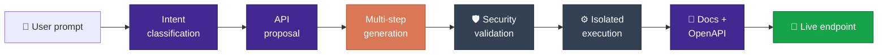
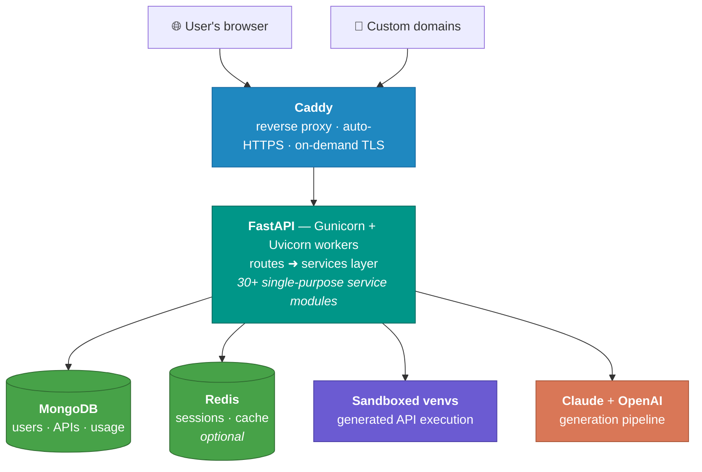

<div align="center">


# BucketAPI

### Describe an API in plain English.<br>Get a live, hosted, documented endpoint in minutes.

<p>
  
  
  
  
  
  
</p>
<p>
  
  
</p>

</div>

BucketAPI is a full-stack SaaS platform that turns natural-language descriptions into working REST APIs. Users chat with an AI assistant about what they need, review a generated proposal, and the platform writes the code, tests it, documents it, and deploys it to a live URL — all automatically.

---

## 📸 Screenshots

<div align="center">

<!-- Drop your screenshots into docs/screenshots/ using these filenames and they will appear here. -->


<em>Landing page</em>

<br><br>

<table>
<tr>
<td width="50%"><br><em align="center">Chat-driven API creation</em></td>
<td width="50%"><br><em>Generated API proposal</em></td>
</tr>
<tr>
<td width="50%"><br><em>Generated API &amp; docs</em></td>
<td width="50%"><br><em>Usage &amp; account dashboard</em></td>
</tr>
</table>

</div>

---

## ✨ What It Does

### 1. Chat-driven API creation
- A conversational interface analyzes the user's request, classifies message intent, and produces a structured **API proposal** (endpoints, inputs, outputs, logic).
- Users can refine the proposal through follow-up messages before anything is generated.

### 2. Multi-step AI code generation
Code generation is broken into a configurable pipeline rather than a single LLM call:

1. **Analysis & Design** — requirements analysis and API structure design
2. **Implementation** — code generation (with optional database integration)
3. **Testing & Documentation** — test generation and human-readable docs

Each step streams real-time progress to the browser, tracks token usage, and has its own prompt template (versioned JSON prompts under `app/prompts/`). Claude handles code generation; OpenAI handles analysis, intent classification, and validation tasks.



<div align="center">
<sub>🟪 <b>OpenAI</b> — intent, proposal, documentation &nbsp;·&nbsp; 🟧 <b>Claude</b> — code generation &nbsp;·&nbsp; ⬛ <b>Platform</b> — validation &amp; execution</sub>
</div>

### 3. Instant hosting & execution
Every generated API is immediately live at:

```
POST /api/{user_id}/{api_slug}
```

- Code runs in a **sandboxed virtual environment** with CPU, memory, and timeout limits.
- A **2-venv architecture** separates the platform's environment from generated-API dependencies; required packages are auto-detected and installed on the fly.
- APIs are **versioned** — every modification creates a restorable version.

### 4. Everything around the API
- **Auto-generated documentation** and OpenAPI specs for each API
- **AI test-data generation** and one-click endpoint testing
- **AI debugging** — failed executions can be analyzed and fixed automatically
- **External database connections** (users can wire generated APIs to their own PostgreSQL/other databases, with connection testing)
- **API keys** for programmatic access to generated endpoints
- **Custom domains** — users can point their own domain at their APIs, with DNS verification and automatic SSL certificates via Caddy

### 5. SaaS infrastructure
- **Auth**: Google/GitHub OAuth for signup, server-side sessions stored in MongoDB (`user_sessions`) and carried as an opaque `HttpOnly` cookie, with per-user session capping and expiry; optional Redis-backed sessions for multi-worker deployments
- **Billing**: LemonSqueezy subscriptions (Starter / Professional / Enterprise tiers) with webhook-driven subscription lifecycle
- **Usage metering**: token-based usage tracking, per-tier limits, and cost estimation for both API generation and API execution
- **Admin panel** and a **logs dashboard** with structured HTTP / LLM / chat logging
- SEO basics: generated `sitemap.xml` and `robots.txt`

---

## 🏗️ How It's Built

### Architecture



### Tech stack

| Layer | Technology |
|---|---|
| Backend | Python 3.11, FastAPI, Pydantic v2, async throughout |
| AI | Anthropic Claude (code generation), OpenAI (analysis/validation), tiktoken for token accounting |
| Database | MongoDB — `pymongo` for platform data; `motor` (async) for user-supplied database connections |
| Cache / sessions | Redis (optional — cookie-backed sessions by default) |
| Frontend | Server-rendered Jinja2 templates + vanilla JavaScript, Tailwind (CDN) with streaming chat |
| Auth | Cookie sessions, PBKDF2-SHA256 password hashing (legacy bcrypt hashes still verified), Authlib for Google/GitHub OAuth |
| Payments | LemonSqueezy |
| Web server | Caddy (automatic SSL, custom-domain routing) → Gunicorn + Uvicorn workers |
| Deployment | Docker (multi-stage build), deployable to DigitalOcean or Railway |

### Design decisions worth noting

- **Service-oriented backend** — the logic lives in ~30 focused service modules (`claude_service`, `sandbox_service`, `venv_manager`, `subscription_service`, `domain_verification_service`, …) rather than fat route handlers, which kept a large codebase maintainable as features grew.
- **Prompts as versioned config** — every LLM prompt is a JSON file loaded by a prompt loader, so prompt iteration doesn't require code changes.
- **Sandboxed execution** — generated (untrusted) code never runs in the main process: it executes in an isolated virtual environment with resource limits, monitored by `psutil`.
- **Streaming-first UX** — proposal generation and the multi-step pipeline stream results token-by-token, so users watch their API being designed and written live.
- **Security hardening** — secure error responses that don't leak internals, security scanning of generated code before execution, non-root container user, and rate/usage limits per subscription tier.
- **Runtime-tunable settings** — model choice, temperature, and token limits are read from a database-backed settings service, so the admin panel can retune the AI pipeline without redeploying.

---

## 📁 Project Structure

<details>
<summary><b>Expand file tree</b></summary>

<br>

```
├── app/
│   ├── main.py                    # FastAPI app + ~110 routes
│   ├── config.py                  # Environment + DB-backed settings
│   ├── models.py                  # Pydantic request/response models
│   ├── routes/                    # Auth & OAuth routers
│   ├── services/                  # 30+ service modules (AI, sandbox, billing, domains…)
│   ├── prompts/                   # Versioned JSON prompt templates (claude/ & openai/)
│   ├── middleware/                # Logging + Redis session middleware
│   └── code_generation_config/    # Multi-step pipeline configuration
├── templates/                     # Jinja2 pages (landing, dashboard, docs, admin…)
├── static/                        # CSS/JS (streaming chat UI, API details, docs)
├── Caddyfile                      # Reverse proxy + on-demand TLS for custom domains
├── Dockerfile                     # Multi-stage build (Caddy + Python app)
├── docker-compose.production.yml
└── start.sh                       # Boots Caddy + Gunicorn together
```

</details>

---

## 🚀 Running Locally

**Prerequisites:** Python 3.11 (the Docker image pins it; newer versions work — see **Known Issues** at the end) and a reachable MongoDB.

```bash
# 1. Dependencies
python -m venv venv
venv\Scripts\activate           # Windows
# source venv/bin/activate      # macOS / Linux
pip install -r requirements.txt

# 2. MongoDB — a throwaway container is the quickest option
docker run -d --name bucketapi-mongo -p 27017:27017 mongo:7

# 3. Create .env (see below), then start
python main.py                  # http://127.0.0.1:8001
```

The app redirects `/` to `/landing`; interactive API docs are at `/docs`.

A minimal `.env`:

```ini
ENVIRONMENT=development
MONGODB_URL=mongodb://localhost:27017
MONGODB_DB_NAME=bucketapi
SECRET_KEY=<any long random string>
OPENAI_API_KEY=<your key>
CLAUDE_API_KEY=<your key>
```

> **Both AI keys must be non-empty for the app to boot**, even if you don't plan to call the models. `OpenAIService` and `ClaudeService` are constructed at import time and raise on a missing key.

> **Generation needs both providers.** Claude writes the API code; OpenAI drives chat, intent classification, and documentation. An OpenAI key alone gets you as far as the proposal, then fails.

### Signing in locally

Account creation is **OAuth-only** — there is no signup route. Either configure Google/GitHub credentials, or insert a user document into MongoDB directly (hashing the password with `auth_service.hash_password`) and call `POST /auth/login`, which still accepts email + password even though the login page no longer renders that form.

---

## ⚙️ Environment Variables

Five are required; everything else has a working default.

<details>
<summary><b>Expand full reference</b> — 17 variables</summary>

<br>

| Variable | Required | Default | Purpose |
|---|---|---|---|
| `MONGODB_URL` | ✅ | — | Connection string; startup fails without it |
| `MONGODB_DB_NAME` | ✅ | — | Database name |
| `SECRET_KEY` | ✅ | — | Session cookie signing |
| `OPENAI_API_KEY` | ✅ | — | Chat, intent classification, documentation |
| `CLAUDE_API_KEY` | ✅ | — | API code generation |
| `ENVIRONMENT` | | `development` | Drives cookie security, CORS origins, error verbosity |
| `HOST` / `PORT` | | `127.0.0.1` / `8001` | Bind address |
| `OPENAI_MODEL` | | `gpt-4-turbo` | Claude model is set via the settings service |
| `USE_REDIS_SESSIONS` | | `false` | Enable for multi-worker deployments |
| `REDIS_URL` | | `redis://localhost:6379/0` | Only read when Redis sessions are on |
| `SESSION_COOKIE_DOMAIN` | | — | e.g. `.bucketapi.com` to share across subdomains |
| `GOOGLE_CLIENT_ID` / `_SECRET` | | — | Google OAuth |
| `GITHUB_CLIENT_ID` / `_SECRET` | | — | GitHub OAuth |
| `MAIN_DOMAIN` | | `bucketapi.com` | Custom-domain routing |
| `CADDY_ADMIN_URL` | | `http://localhost:2019` | Caddy admin API |
| `CADDY_EMAIL` | | `admin@bucketapi.com` | Let's Encrypt contact |
| `SECURITY_SERVICE_ENABLED` | | `true` | Static analysis of generated code |

Models, token limits, retry policy, and feature flags can also be overridden at runtime from the `system_settings` collection (cached 60s) — see `app/config.py`.

</details>

---

## 📦 Deployment

Production runs Caddy and FastAPI in one container: Caddy terminates TLS on 80/443 and reverse-proxies to Gunicorn on 8000, with `start.sh` supervising both and dropping the app to a non-root user.

```bash
docker compose -f docker-compose.production.yml up -d --build
```

`railway.toml` builds from the Dockerfile with a `/health` healthcheck; `DEPLOY_SCRIPT.sh` covers the DigitalOcean path.

---

## 🧪 Testing

```bash
pytest tests/
```

`tests/` mixes the pytest suite (`test_main.py`, `test_api_simple.py`, `test_venv_system.py`) with operational and migration scripts that talk to a live database — read those before running them.

---

## ⚠️ Known Issues

- **`requirements.txt` is unpinned.** Almost every dependency uses `>=`, so a fresh install resolves to current releases. Notably, **Starlette ≥ 1.0 removed the `TemplateResponse(name, context)` signature** this codebase uses in 13 places — every HTML page then returns a 500 with `TypeError: unhashable type: 'dict'`. Pin `fastapi==0.115.6` / `starlette==0.41.3`, or migrate the calls to `TemplateResponse(request, name, context)`.
- **No signup route.** `/register` does not exist; accounts come from OAuth only.
- **Free tier allows 1 API generation per month**, enforced with `>=`, which makes local end-to-end testing awkward without raising the tier or clearing usage.
- `datetime.utcnow()` is deprecated on Python 3.12+ and emits warnings.

---

## 📌 Status

This project was built as a solo full-stack product — design, backend, frontend, AI pipeline, billing, and deployment. It's shared publicly as a portfolio piece demonstrating production-grade work with LLM orchestration, sandboxed code execution, and SaaS infrastructure.
